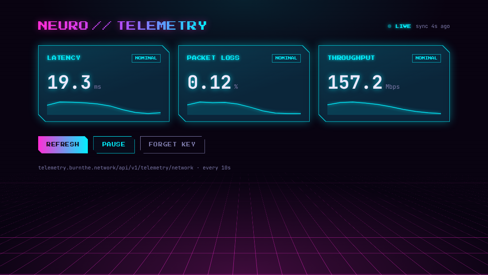

# Neuro // Telemetry

[](https://github.com/gjb1088/DashboardAPI/actions/workflows/deploy.yml)

A neon, 8-bit style dashboard for checking live network telemetry from the NeuroDevOps stack from anywhere: latency, packet loss and throughput, refreshed every 10 seconds.

**Live:** https://gjb1088.github.io/DashboardAPI/


<sub>Screenshot uses simulated data.</sub>

## Features

- **Live polling** every 10s, with pause/resume. Polling stops while the tab is in the background and catches up when you return.
- **Health at a glance.** Each metric turns cyan, amber or red against thresholds in [`src/lib/metrics.ts`](src/lib/metrics.ts).
- **Sparklines** of the last 60 readings, plus values that count up to each new reading.
- **Key entry in the browser.** The API key is typed in once and kept in that browser's local storage, so it never ships in the public bundle.
- **Clear failures.** Timeouts, rejected keys and network or CORS errors are shown on the page as terminal-style messages.
- Responsive down to phone width, and honours `prefers-reduced-motion`.

## How it works

```
browser ──X-API-Key──▶ telemetry.burnthe.network/api/v1/telemetry/network ──▶ NeuroDevOps
                        (Cloudflare → Caddy → API)
```

The endpoint returns JSON with `latency` (ms), `packet_loss` (%) and `throughput` (Mbps).

## Run locally

```bash
npm install
cp .env.example .env   # optional; the defaults point at the live API
npm run dev
```

| Script | What it does |
| --- | --- |
| `npm run dev` | Dev server with hot reload |
| `npm run check` | Type-check with svelte-check |
| `npm run build` | Production build to `dist/` |
| `npm run preview` | Serve the production build |

### Configuration

| Variable | Default | Notes |
| --- | --- | --- |
| `VITE_TELEMETRY_API_BASE` | `https://telemetry.burnthe.network` | Base URL only; the `/api/v1/...` path is added in code |
| `VITE_TELEMETRY_API_KEY` | _(empty)_ | Optional. `VITE_` variables are compiled into the public JS, so leave this empty for public deploys and enter the key in the app instead |

## Deployment

[`.github/workflows/deploy.yml`](.github/workflows/deploy.yml) type-checks and builds every pull request, and deploys `main` to GitHub Pages. Pages must be set to **Settings → Pages → Source: GitHub Actions**. The API has to allow the `https://gjb1088.github.io` origin (CORS) for the browser to read responses.

## Stack

Svelte 4 · TypeScript · Vite · Press Start 2P + JetBrains Mono
